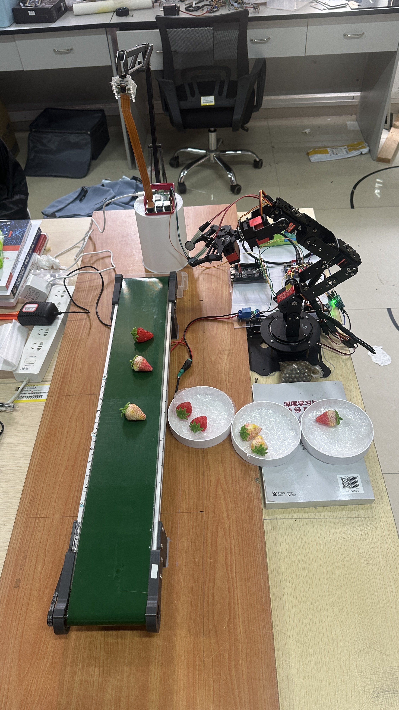
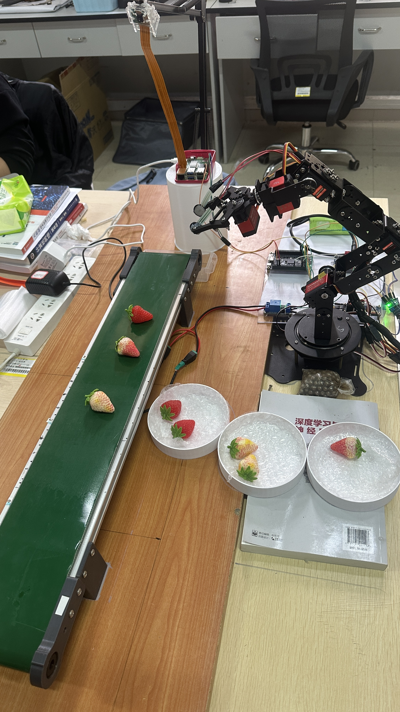
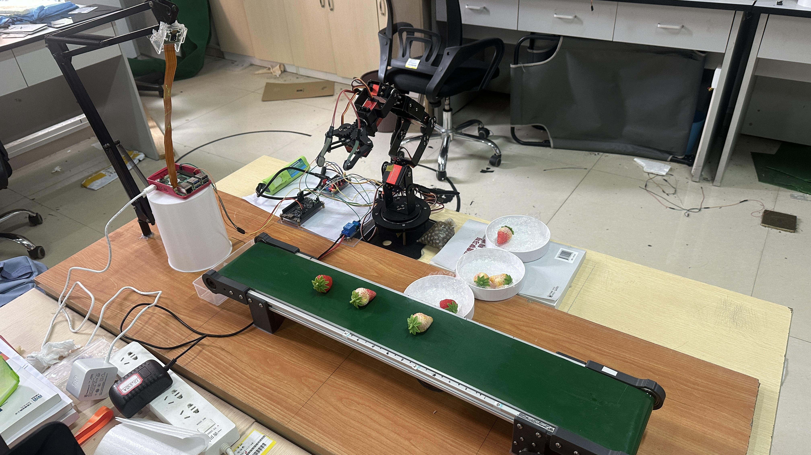
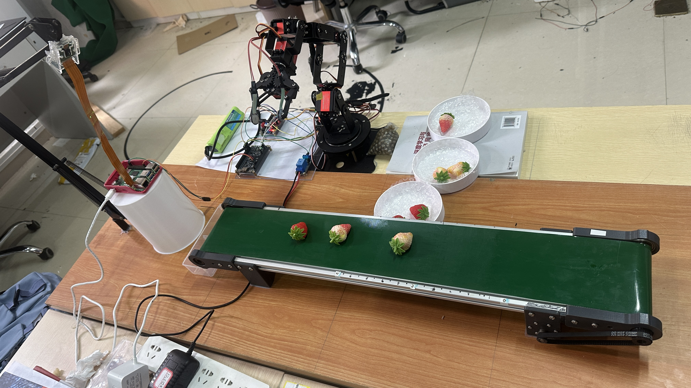
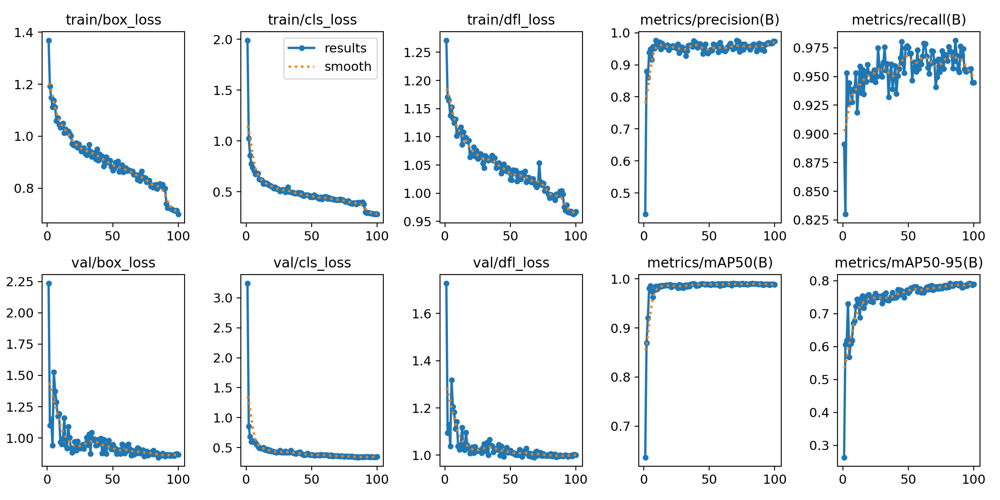
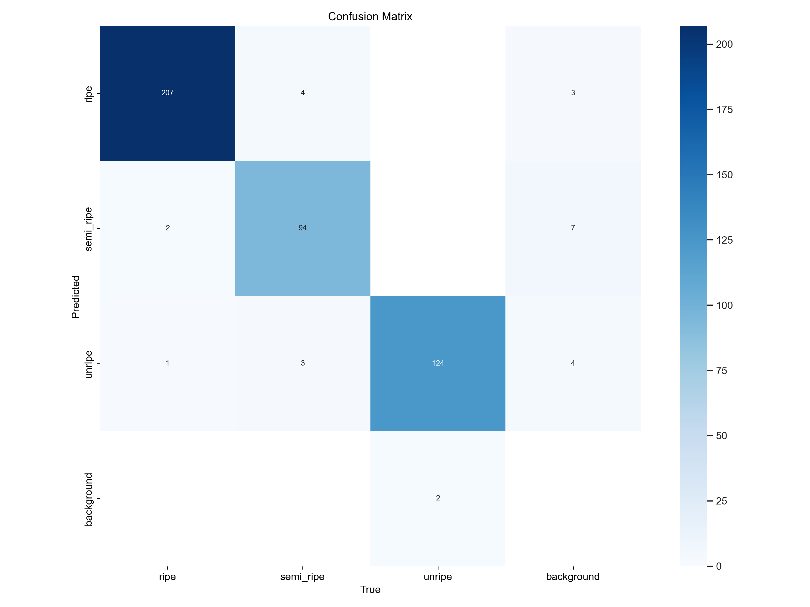
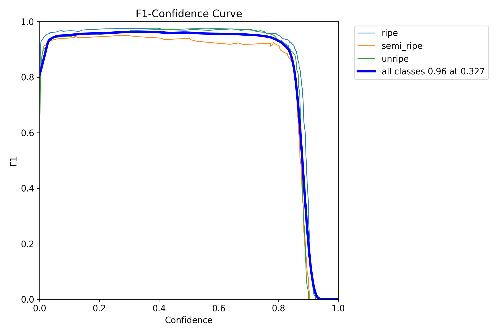

# 草莓眼手力柔性抓取机器人

> 基于 Renesas RA6M5 + Raspberry Pi 5 的异构双脑架构，实现草莓视觉识别、成熟度分级、柔性抓取、触觉反馈与端侧 TinyML 推理的完整闭环分拣系统。

<p align="center">
  
  <br/>
  <sub>需要观看作品演示视频，可联系作者提供。</sub>
</p>

## 核心亮点

- **眼（视觉）** — 树莓派 5 运行 YOLOv8n，实时检测草莓并三级分类（成熟/半成熟/未熟），mAP50 达 **98.8%**
- **手（执行）** — 6自由度机械臂通过 PCA9685 驱动，插值缓动轨迹 + 安全过渡状态机
- **力（触觉）** — FSR402B 薄膜压力传感器 200Hz 采样，自适应夹持力闭环控制
- **TinyML** — RA6M5 Cortex-M33 上部署 INT8 量化 1D-CNN，实时分类抓取状态（稳定 / 滑脱风险）
- **安全保护** — ADC 窗口比较器硬件中断，微秒级异常力响应保护

## 系统架构

```
┌──────────────────────────────────────────────────────────────────┐
│                  树莓派 5（视觉大脑）                               │
│  CSI 摄像头 ─→ YOLOv8n 检测 ─→ 成熟度分类                         │
│                        │                                         │
│              UART 串口（115200 波特率）                             │
│                        ▼                                         │
│                  Renesas RA6M5（控制小脑）                          │
│  串口指令解析 ─→ 状态机 ─→ PCA9685 I2C ─→ 6自由度机械臂             │
│                                                                  │
│  FSR402B ─→ ADC 200Hz 采样 ─→ 力控 PID ─→ 夹爪力度调节             │
│                    │                                             │
│              TinyML 1D-CNN（INT8 量化）                            │
│         压力时序数据 ─→ 抓取状态分类                                 │
│                                                                  │
│  ADC 窗口比较器 ─→ 硬件中断 ─→ 紧急释放                             │
└──────────────────────────────────────────────────────────────────┘
```

## 实物展示

<table>
  <tr>
    <td></td>
    <td></td>
  </tr>
  <tr>
    <td align="center"><b>正面视角</b> — 传送带 + 机械臂 + 分拣碗</td>
    <td align="center"><b>侧面视角</b> — 完整工作台布局</td>
  </tr>
  <tr>
    <td></td>
    <td></td>
  </tr>
  <tr>
    <td align="center"><b>分拣演示</b> — 草莓在传送带上等待分类</td>
    <td align="center"><b>系统全景</b> — 完整系统</td>
  </tr>
</table>

## YOLOv8n 训练结果

模型：YOLOv8n | 输入尺寸：640x640 | 训练轮次：100 | 数据集：1185 张训练 / 209 张验证

| 指标 | 数值 |
|------|------|
| mAP50 | **98.8%** |
| mAP50-95 | **78.9%** |
| 精确率 (Precision) | **97.4%** |
| 召回率 (Recall) | **94.5%** |
| F1 分数 | **0.96** |

<table>
  <tr>
    <td></td>
    <td></td>
  </tr>
  <tr>
    <td align="center">训练与验证曲线</td>
    <td align="center">混淆矩阵</td>
  </tr>
</table>

<p align="center">
  
  <br><i>F1-置信度曲线 — 全类别 F1=0.96 @ 置信度阈值=0.327</i>
</p>

## 技术栈

| 层级 | 组件 | 职责 |
|------|------|------|
| 视觉层 | 树莓派 5 + OV5647 CSI 摄像头 | 图像采集、YOLOv8n 推理、任务调度 |
| 控制层 | Renesas RA6M5 (Cortex-M33 @ 200MHz) | 实时控制、力控 PID 闭环、TinyML 推理 |
| 执行层 | 6自由度机械臂 + PCA9685 驱动板 | I2C 驱动 6 路舵机 |
| 末端执行器 | 柔性夹爪 + FSR402B 薄膜压力传感器 | 触觉反馈、自适应夹持力 |
| 传输层 | 传送带 + 继电器控制 | 草莓自动输送 |
| 通信层 | UART 115200 波特率 | 树莓派 ↔ RA6M5 双向指令链路 |

## 分拣流水线

```
传送带 → 摄像头采图 → YOLOv8n 检测 → 成熟度分类
                                          │
                              ┌───────────┼───────────┐
                              ▼           ▼           ▼
                          指令 "A"     指令 "B"     指令 "C"
                          （成熟）     （半成熟）    （未熟）
                              │           │           │
                    UART ─────┴───────────┴───────────┘
                              ▼
                    RA6M5 状态机执行
                              │
              ┌───────────────┼────────────────┐
              ▼               ▼                ▼
          位置 A           位置 B           位置 C
        （成熟碗）       （半成熟碗）       （未熟碗）
```

## 项目结构

```
strawberry_grasp/
├── images/                        # 实物照片
├── vision/
│   ├── pi/                        # 树莓派部署代码
│   │   ├── config.py              #   全局配置（串口、摄像头、YOLO、阈值）
│   │   ├── camera.py              #   CSI 摄像头封装（picamera2）
│   │   ├── detector.py            #   YOLOv8n 推理封装
│   │   ├── serial_comm.py         #   与 MCU 的串口通信
│   │   ├── main.py                #   主流水线（采图 → 检测 → 发送指令）
│   │   ├── capture_dataset.py     #   数据集采集工具
│   │   └── calibrate.py           #   摄像头-机械臂坐标标定
│   ├── runs/strawberry_v12/       # 训练结果（曲线、指标）
│   ├── train.py                   # PC 端训练脚本
│   ├── train_tinyml.py            # TinyML 模型训练（1D-CNN 抓取状态分类）
│   ├── data.yaml                  # YOLO 数据集配置
│   └── merge_dataset.py           # 数据集合并工具
├── output/                        # MCU 固件版本迭代（C 源码）
│   ├── hal_entry_state_machine.c          # v1：基础状态机
│   ├── hal_entry_state_machine_v2.c       # v2：插值缓动 + TRANSIT 安全过渡
│   ├── hal_entry_state_machine_v3_gripper_split.c  # v3：夹爪分体控制
│   ├── hal_entry_v4_wrist_rotate.c        # v4：腕部旋转
│   ├── hal_entry_v5_fsr_debug.c           # v5：FSR 压力传感器集成
│   └── hal_entry_with_uart.c              # UART 通信集成
├── docs/                          # 技术文档
│   ├── 系统设计规格书.md
│   ├── 机械臂布局与参数.md
│   ├── 硬件接线档案.md
│   ├── 舵机标定记录.csv
│   └── ...
└── README.md
```

## MCU 状态机设计

RA6M5 固件实现了稳健的抓取状态机：

```
空闲 ──(串口指令)──→ 过渡 ──(插值运动)──→ 接近
                                            │
                                    (检测到接触)
                                            ▼
放置 ←──(提升完成)── 提升 ←──(夹持稳定)── 夹爪闭合
  │                                        │
  │                            (TinyML: 滑脱风险?)
  │                                   ▼
  │                               力度调节
  │
  └──→ 回位 ──→ 空闲

  * 任意状态 ──(ADC 中断: 力超阈值)──→ 紧急释放
```

核心特性：
- **插值过渡** — 舵机运动通过线性插值实现平滑移动，防止机械冲击
- **TRANSIT 安全状态** — 姿态切换时的强制过渡状态，验证路径安全
- **力控 PID 闭环** — 200Hz 采样，根据成熟度等级自适应调节增益
- **TinyML 推理** — INT8 量化 1D-CNN 对 50 个采样点的压力窗口分类，输出稳定/滑脱风险
- **硬件紧急保护** — ADC 窗口比较器触发硬件中断，微秒级响应，绕过软件延迟

## 舵机配置

| 通道 | 关节 | 规格 | HOME 角度 |
|------|------|------|-----------|
| CH5 | 底座旋转 | 30kg / 270° | 135° |
| CH1 | 肩关节 | 25kg / 180° | 90° |
| CH0 | 肘关节 | 20kg / 180° | 45° |
| CH2 | 腕部俯仰 | 20kg / 180° | 90° |
| CH3 | 腕部旋转 | 20kg / 180° | 90° |
| CH4 | 夹爪开合 | 20kg / 180° | 80°（张开） |

## 快速开始

### 树莓派端（视觉）

```bash
# 部署代码到树莓派
scp -r vision/pi/* pi@<树莓派IP>:~/strawberry_grasp/

# 在树莓派上安装依赖
pip install ultralytics opencv-python-headless

# 干跑模式（不连接 MCU，仅查看检测效果）
python main.py --dry-run --preview

# 正常运行（通过 UART 连接 MCU）
python main.py
```

### MCU 端（控制）

1. 用 Renesas e2studio 打开 `output/hal_entry_v5_fsr_debug.c`（最新固件）
2. 编译并通过 J-Link / PyOCD 烧录到 RA6M5
3. 连接 UART（SCI9: TX=P109, RX=P110）到树莓派的 `/dev/serial0`

## 通信协议

| 方向 | 指令 | 含义 |
|------|------|------|
| 树莓派 → MCU | `A` | 检测到成熟草莓，抓取到 A 碗 |
| 树莓派 → MCU | `B` | 检测到半成熟草莓，抓取到 B 碗 |
| 树莓派 → MCU | `C` | 检测到未熟草莓，抓取到 C 碗 |
| 树莓派 → MCU | `G` | 启动传送带 |
| 树莓派 → MCU | `X` | 停止传送带 |
| MCU → 树莓派 | `DONE` | 抓取-放置周期完成 |
| MCU → 树莓派 | `ERR` | 紧急停止或故障 |

## 许可说明

本项目用于学术展示与项目经验记录，仅供学习参考。
